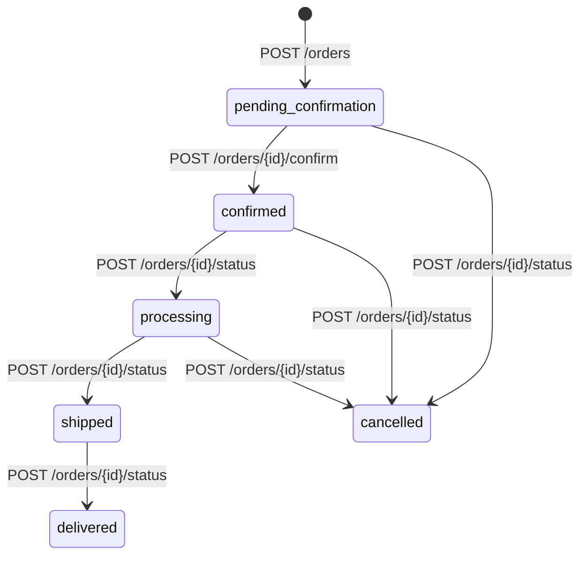
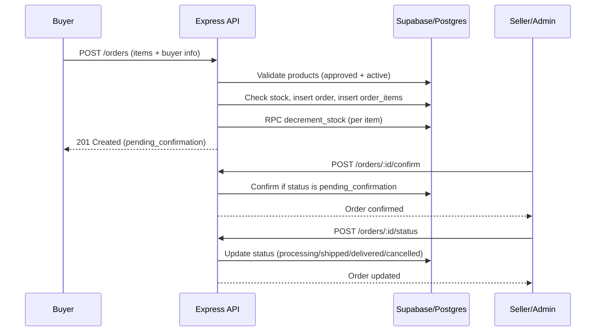

# Marketplace Backend — Supabase Edition

Supabase handles **all auth** (passwords, JWTs, email verification, password reset).
Your Express API handles **business logic** and enforces roles using Supabase JWTs.
PostgreSQL **RLS policies** enforce data access at the database layer as a safety net.

---

## Why this architecture is right for a startup

| What Supabase gives you for free | What you'd otherwise build |
|----------------------------------|---------------------------|
| User registration + login        | bcrypt, JWT signing, token rotation |
| Email verification               | Email provider + confirmation flow |
| Password reset                   | Secure token generation + email |
| OAuth (Google, GitHub, etc.)     | Passport.js + provider credentials |
| Managed PostgreSQL               | DB server, backups, patching |
| Row Level Security               | `WHERE user_id = ?` in every query |
| Realtime subscriptions           | WebSocket server |
| Dashboard to inspect data        | pgAdmin / custom admin UI |

---

## Setup — 5 steps

### 1. Create a Supabase project
Go to [supabase.com](https://supabase.com) → New project → choose a region close to your users.

### 2. Run the schema
Supabase Dashboard → **SQL Editor** → New query → paste `supabase/schema.sql` → Run.

### 3. Configure auth settings
Dashboard → **Authentication** → Settings:
- Disable "Email confirmations" during development (re-enable for production)
- Add your frontend URL to "Site URL"
- Optionally enable Google / GitHub OAuth providers

### 4. Set environment variables
```bash
cp .env.example .env
```
Fill in from Dashboard → **Project Settings** → **API**:
- `SUPABASE_URL` — your project URL
- `SUPABASE_ANON_KEY` — safe to expose to clients
- `SUPABASE_SERVICE_ROLE_KEY` — **never expose** — server-side only

### 5. Run the API
```bash
npm install
npm run dev
```

To create your first admin:
```sql
-- Run in Supabase SQL Editor after registering your account
UPDATE profiles SET is_admin = TRUE WHERE id = 'your-user-uuid';
```

---

## How the two clients work

```
anonClient  (SUPABASE_ANON_KEY)
  └── Used to verify user JWTs via getUser(token)
  └── RLS policies apply — users only see their data

serviceClient  (SUPABASE_SERVICE_ROLE_KEY)
  └── Bypasses RLS — used ONLY in your backend for admin operations
  └── NEVER send this key to the frontend
```

---

## Role flow

```
Register → buyer by default (is_seller: false)
    │
    ├── GET /contract             ← display contract text to user
    ├── POST /contract/sign       ← user agrees → is_seller: true immediately
    │
    ↓
Seller → submits products
    │
    ├── POST /products            ← review_status: 'pending_review'
    │
    ├── Admin: POST /products/:id/approve  ← product goes live
    └── Admin: POST /products/:id/reject   ← seller sees rejection_note
```

---

## API Reference

### Auth  `/auth`
| Method | Endpoint | Auth | Description |
|--------|----------|------|-------------|
| POST | /register | — | Register. `lang` (en/fr/ar) saved from language screen |
| POST | /login | — | Returns `access_token` + `refresh_token` |
| POST | /logout | JWT | Invalidates session |
| POST | /refresh | — | Exchange `refresh_token` for new `access_token` |
| GET  | /me | JWT | Current user + profile |
| PUT  | /me | JWT | Update name, phone, address, lang |

> **Password reset / email verify** — handled entirely by Supabase.
> Call `supabase.auth.resetPasswordForEmail(email)` from your frontend — no backend route needed.

### Contract  `/contract`
| Method | Endpoint | Auth | Description |
|--------|----------|------|-------------|
| GET  | / | — | Fetch contract text + version |
| GET  | /status | JWT | Has user signed current version? |
| POST | /sign | JWT | Accept → `is_seller: true` instantly |

### Products  `/products`
| Method | Endpoint | Auth | Description |
|--------|----------|------|-------------|
| GET    | /               | —            | Browse approved products |
| GET    | /:id            | —            | Single approved product |
| GET    | /mine           | JWT + seller | Own products (all statuses) |
| POST   | /               | JWT + seller | Submit for review |
| PUT    | /:id            | JWT + seller | Edit (resets to pending_review) |
| DELETE | /:id            | JWT + seller | Deactivate listing |
| GET    | /admin/queue    | JWT + admin  | Products pending review |
| POST   | /:id/approve    | JWT + admin  | Approve → live |
| POST   | /:id/reject     | JWT + admin  | Reject with required note |

### Orders  `/orders`
| Method | Endpoint | Auth | Description |
|--------|----------|------|-------------|
| POST | /            | JWT          | Place order (name, address, phone) |
| GET  | /my          | JWT          | Buyer: own orders |
| GET  | /seller      | JWT + seller | Seller: orders with their products |
| GET  | /admin/all   | JWT + admin  | All orders (`?status=` filter) |
| POST | /:id/confirm | JWT + seller/admin | Confirm after direct contact |
| POST | /:id/status  | JWT + seller/admin | Update status |

### Admin  `/admin`
| Method | Endpoint | Auth | Description |
|--------|----------|------|-------------|
| GET | /users                    | JWT + admin | All users (`?is_seller=true`, `?search=`) |
| GET | /stats                    | JWT + admin | Users / products / orders counts + revenue |
| PUT | /users/:id/toggle-admin   | JWT + admin | Grant / revoke admin |

---

## Order Lifecycle

### Placement phase
1. Buyer calls `POST /orders` with `items`, `buyer_name`, `buyer_address`, and `buyer_phone`.
2. API validates payload and fetches only approved and active products.
3. API validates stock per item and computes `total_amount`.
4. API inserts order with `pending_confirmation` status.
5. API inserts `order_items` rows with seller link and item snapshot.
6. API decrements stock using the `decrement_stock` RPC.

### Confirmation phase
1. Seller or admin calls `POST /orders/:id/confirm`.
2. Order is confirmed only if current status is `pending_confirmation`.
3. API sets `status = confirmed`, `confirmed_at`, and `updated_at`.

### Fulfillment phase
1. Seller or admin calls `POST /orders/:id/status`.
2. Allowed statuses are `processing`, `shipped`, `delivered`, and `cancelled`.
3. API updates status and writes `updated_at`.

### Visibility by role
1. Buyer: `GET /orders/my` returns only their own orders with items.
2. Verified seller: `GET /orders/seller` returns only orders containing their products, with `my_items` filtered to seller-owned rows.
3. Admin: `GET /orders/admin/all` returns all orders and supports `?status=` filtering.

### State transition diagram



### Sequence diagram



---

## Key design decisions

- **RLS is your safety net.** Even if there's a bug in your Express route, a user querying the DB directly through Supabase client SDK can never read another user's orders or private products.
- **serviceClient bypasses RLS.** All admin operations use `serviceClient` so they can read/write anything. Never let this key reach the client.
- **Editing an approved product resets to `pending_review`.** Prevents sellers from listing something benign, getting approved, then editing to something prohibited.
- **Contract signatures store IP + user-agent.** Legal audit trail. Bump `CONTRACT_VERSION` to require re-signing.
- **`decrement_stock` is a PostgreSQL function.** Prevents race conditions when two buyers order the last item simultaneously — the DB enforces the constraint atomically.
- **No separate JWT library needed.** Supabase issues and verifies all tokens. Your middleware calls `supabase.auth.getUser(token)` — one line replaces all the manual JWT plumbing.

---

## Deployment

Recommended for a startup:
1. **Backend API** → [Railway](https://railway.app) or [Render](https://render.com) — both have free tiers, deploy from GitHub
2. **Database + Auth** → Supabase free tier (500MB DB, 50,000 monthly active users)
3. **File uploads (product images)** → Supabase Storage (already in your project, free tier included)
